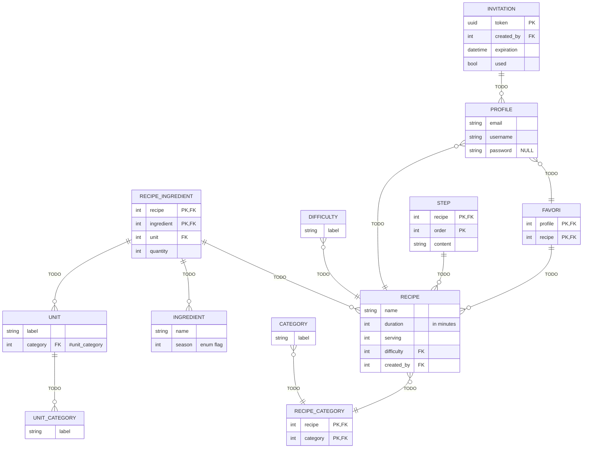

```mermaid
erDiagram
    RECIPE {
        string name
        int duration "in minutes"
        int serving
        int difficulty FK
        int created_by FK
    }
    RECIPE_INGREDIENT {
        int recipe PK, FK
        int ingredient PK, FK
        int unit FK
        int quantity
    }
    INGREDIENT {
        string name
        int season "enum flag"
    }
    CATEGORY {
        string label
    }
    RECIPE_CATEGORY {
        int recipe PK, FK
        int category PK, FK
    }
    DIFFICULTY {
        string label
    }
    UNIT {
        string label
        int category FK "#unit_category"
    }
    UNIT_CATEGORY {
        string label
    }
    PROFILE {
        string email
        string username 
        string password "NULL"
    }
    INVITATION {
        uuid token PK
        int created_by FK
        datetime expiration
        bool used
    }
    FAVORI {
        int profile PK, FK
        int recipe PK, FK
    }
    STEP {
        int recipe PK, FK
        int order PK
        string content
    }
    INVITATION ||--o{ PROFILE: TODO
    PROFILE }o--|| FAVORI: TODO
    PROFILE }o--|| RECIPE: TODO
    STEP ||--o{ RECIPE: TODO
    DIFFICULTY }o--|| RECIPE: TODO
    RECIPE }o--|| RECIPE_CATEGORY: TODO
    CATEGORY }o--|| RECIPE_CATEGORY: TODO
    RECIPE_INGREDIENT ||--o{ RECIPE: TODO
    RECIPE_INGREDIENT ||--o{ INGREDIENT: TODO
    RECIPE_INGREDIENT ||--o{ UNIT: TODO
    UNIT ||--o{ UNIT_CATEGORY: TODO
    FAVORI ||--o{ RECIPE: TODO
```